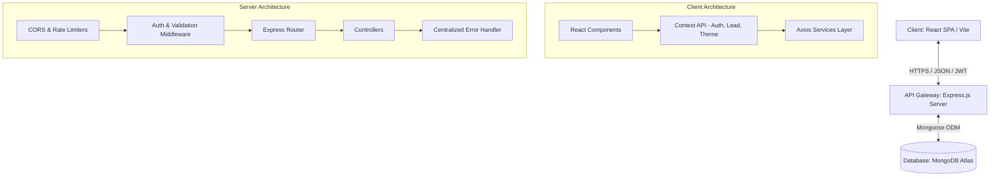
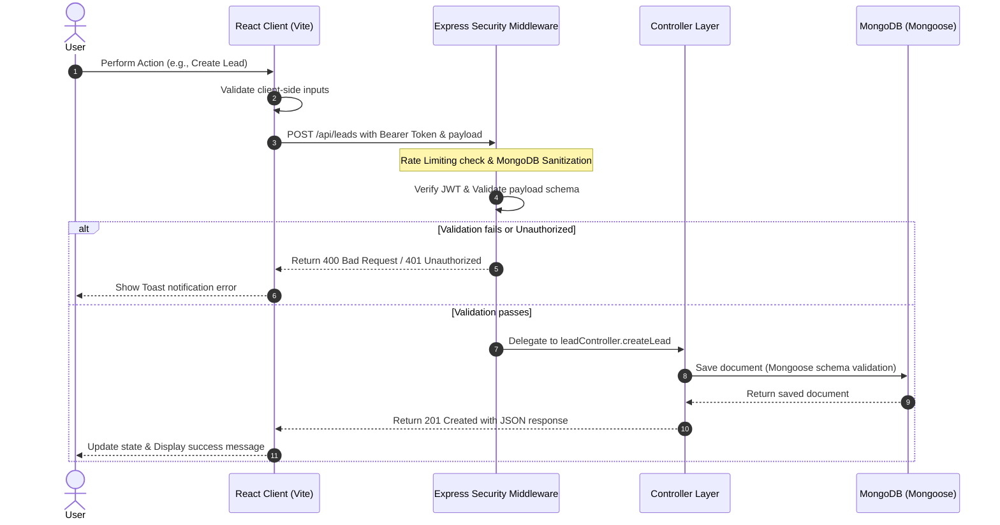

# Startup CRM Lite

<p align="center">
  
</p>

<p align="center">
  <strong>A high-performance, lightweight Sales CRM designed for fast-growing startups.</strong>
</p>

<p align="center">
  
  
  
  
  
  
  
</p>

---

## Table of Contents

- [Project Overview](#project-overview)
  - [Problem Statement](#problem-statement)
  - [Vision \& Objectives](#vision--objectives)
  - [Key Features](#key-features)
  - [Target Users](#target-users)
  - [Use Cases](#use-cases)
  - [Business Value](#business-value)
- [Screenshots \& UI Tour](#screenshots--ui-tour)
- [Complete System Architecture](#complete-system-architecture)
  - [High-Level Architecture Overview](#high-level-architecture-overview)
  - [Application Workflow](#application-workflow)
  - [End-to-End User Flow](#end-to-end-user-flow)
- [Technology Stack](#technology-stack)
- [Project Folder Structure](#project-folder-structure)
  - [Detailed Directory Breakdown](#detailed-directory-breakdown)
  - [Key Files Explanation](#key-files-explanation)
- [Technical Architecture \& Design Patterns](#technical-architecture--design-patterns)
  - [Frontend Architecture](#frontend-architecture)
  - [Backend Architecture](#backend-architecture)
  - [Database Architecture](#database-architecture)
  - [API Overview](#api-overview)
  - [Authentication \& Authorization](#authentication--authorization)
  - [State Management](#state-management)
  - [Storage Strategy](#storage-strategy)
  - [Third-Party Services \& Integrations](#third-party-services--integrations)
  - [AI/Automation Components](#aiautomation-components)
- [Development \& Operation Guide](#development--operation-guide)
  - [Development Prerequisites](#development-prerequisites)
  - [Installation Guide](#installation-guide)
  - [Environment Variables Configuration](#environment-variables-configuration)
  - [Running the Project](#running-the-project)
  - [Build Process](#build-process)
  - [Deployment Guide](#deployment-guide)
  - [CI/CD Overview](#cicd-overview)
  - [Testing Strategy](#testing-strategy)
- [Operational Runbook](#operational-runbook)
  - [Debugging Tips](#debugging-tips)
  - [Logging \& Monitoring](#logging--monitoring)
  - [Security Considerations](#security-considerations)
  - [Performance Optimizations](#performance-optimizations)
- [Software Engineering Governance](#software-engineering-governance)
  - [Coding Standards \& Project Conventions](#coding-standards--project-conventions)
  - [Versioning Strategy](#versioning-strategy)
  - [Branching Strategy](#branching-strategy)
  - [Contribution Guidelines](#contribution-guidelines)
  - [Release Process](#release-process)
- [Known Limitations \& Future Roadmap](#known-limitations--future-roadmap)
  - [Known Limitations](#known-limitations)
  - [Future Roadmap](#future-roadmap)
- [Frequently Asked Questions (FAQ)](#frequently-asked-questions-faq)
- [Troubleshooting Guide](#troubleshooting-guide)
- [Changelog](#changelog)
- [License \& Contacts](#license--contacts)
  - [License](#license)
  - [Credits \& Acknowledgements](#credits--acknowledgements)
  - [Contact Information](#contact-information)
  - [Final Project Summary](#final-project-summary)

---

## Project Overview

### Problem Statement
Startups move fast but are often bogged down by complex, over-engineered Enterprise CRM solutions (like Salesforce or HubSpot). These platforms feature steep learning curves, expensive seat pricing, and heavy interfaces, forcing small teams to resort to chaotic spreadsheets. Startups need an agile, fast, secure, and intuitive sales tracking tool that provides visual visibility without the bloat.

### Vision & Objectives
**Startup CRM Lite** bridges the gap between chaotic spreadsheets and enterprise monoliths. It delivers a high-fidelity, single-page application (SPA) focused on visual pipeline tracking, robust statistics, lightning-fast lead search, and seamless analytics. 

### Key Features
*   **Visual Pipeline Overview**: Track leads across customizable sales stages (`New`, `Contacted`, `Meeting Scheduled`, `Proposal Sent`, `Won`, `Lost`) with quick status updates.
*   **Comprehensive Analytics Dashboard**: Advanced data visualizations including monthly trends, lead conversion funnel, lead source distributions, revenue projections, and sales velocity metrics.
*   **Instant Autocomplete Search**: Search leads by name, company, email, or status with real-time feedback.
*   **Advanced Lead Management**: Interactive forms to create, update, filter, paginate, and delete lead records with validation.
*   **Secure Authentication System**: JSON Web Token (JWT) based authentication, session expiration warnings, and secure password hashing.
*   **Responsive Dark/Light Mode**: Full custom Tailwind-powered responsive theme framework for developer-focused interfaces.

### Target Users
*   **Founders & Sole Proprietors**: Managing early sales outreach.
*   **Sales Executives & Account Executives**: Tracking prospects from discovery to close.
*   **Growth Marketers**: Monitoring lead acquisition channels and conversion rates.

### Use Cases
1.  **Pipeline Management**: Moving a qualified lead from "Meeting Scheduled" to "Proposal Sent" using inline status controls.
2.  **Conversion Funnel Analysis**: Evaluating where leads drop off in the sales process to optimize pitch scripts.
3.  **Lead Performance Tracking**: Visualizing top lead-generating channels (e.g. LinkedIn vs. Referral) to allocate ad spend.

### Business Value
*   **Velocity**: Accelerate deal cycles by eliminating administrative overhead.
*   **Data Integrity**: Enforce schema validations on inputs to keep customer databases clean.
*   **Cost Efficiency**: Lightweight, open-source stack that can be self-hosted on micro-services for virtually zero operational cost.

---

## Screenshots & UI Tour

> [!NOTE]
> High-fidelity screenshot references will be added here as the layout evolves. Below are wireframe/layout blueprints of the interface.

| Dashboard Overview | Sales Funnel & Analytics | Lead List & Details |
|---|---|---|
| A clean dashboard showing high-level KPIs, recent leads, and quick action panels. | Advanced Recharts metrics illustrating conversion funnels, revenue forecasts, and performance heatmaps. | Paginated grid view of all leads with search bars and status toggles. |

---

## Complete System Architecture

### High-Level Architecture Overview

Startup CRM Lite is built on a modern decoupled architecture consisting of a React Single Page Application (SPA) on the frontend, communicating asynchronously via RESTful APIs with an Express.js API Gateway, powered by a MongoDB Atlas database.



### Application Workflow

This diagram outlines how requests are routed and handled from the user interface down to the database layers.



### End-to-End User Flow

1.  **Onboarding/Login**: User navigates to `/login` or `/register`. They receive a JWT token stored securely in `localStorage`.
2.  **Dashboard Load**: The landing route `/` fetches stats via `GET /api/leads/stats` and displays KPI cards, visual pipelines, and recent activity.
3.  **Lead Management**: User navigates to `/leads`, types a query in the `SearchBar` which debounces and calls `GET /api/leads/search`, or updates status using `StatusBadge` triggering a patch request.
4.  **Analytics Inspection**: User navigates to `/analytics` to visualize performance graphs rendered through `recharts`.

---

## Technology Stack

### Frontend
*   **React (v19.2.6)**: Component-driven UI development utilizing hooks.
*   **Vite (v8.0.12)**: Bundler and dev server with Hot Module Replacement (HMR).
*   **Tailwind CSS (v4.3.0)**: Utility-first CSS framework with native Vite compilation.
*   **React Router DOM (v7.17.0)**: Declarative, code-split client-side routing.
*   **Recharts (v3.8.1)**: SVG-based responsive charting library.
*   **Axios (v1.18.1)**: HTTP client with global interceptors.
*   **React Hot Toast (v2.6.0)**: Elegant, non-blocking notifications.
*   **Lucide React (v1.18.0)**: Modern vector iconography.

### Backend
*   **Node.js (v20.x)**: Server-side JavaScript runtime.
*   **Express.js (v5.2.1)**: Light web framework configured for ES Modules (`"type": "module"`).
*   **Mongoose (v9.7.3)**: Elegant MongoDB object modeling (ODM).
*   **jsonwebtoken (v9.0.3)**: Stateless JWT authentication tokens.
*   **bcryptjs (v3.0.3)**: Safe password hashing on registration and verification.
*   **express-validator (v7.3.2)**: Declarative request body schema validation.
*   **helmet (v8.2.0)**: Secure HTTP response headers.
*   **express-rate-limit**: Rate limiting against brute-force and DDoS.
*   **morgan (v1.11.0)**: HTTP request logger middleware.

### Database
*   **MongoDB (v7.5.0 Driver)**: Document-oriented NoSQL database. Hosted on **MongoDB Atlas** for high availability.

---

## Project Folder Structure

```
startup-crm-lite/
├── backend/
│   ├── config/             # Database connection setups & settings
│   ├── controllers/        # Route controllers containing business logic
│   ├── middleware/         # Auth, validation, and global error middleware
│   ├── models/             # Mongoose schemas (User, Lead)
│   ├── routes/             # Express route specifications
│   ├── utils/              # API helpers, shared utilities
│   ├── .env                # Backend local environment keys
│   ├── package.json        # Backend dependencies & script definitions
│   └── server.js           # Server application bootstrapper
├── public/                 # Static asset definitions
├── src/
│   ├── assets/             # Images, fonts, and global assets
│   ├── components/         # Reusable presentation and layout components
│   │   ├── analytics/      # Chart containers, data grids, heatmaps
│   │   ├── common/         # Search, filters, sidebar, layouts
│   │   ├── dashboard/      # KPI cards, pipelines, recent leads list
│   │   └── leads/          # Tables, cards, interactive lead forms
│   ├── constants/          # Application global config colors and ranges
│   ├── context/            # React Context stores (Auth, Lead, Theme)
│   ├── hooks/              # Custom reusable hooks (Analytics, local storage, debounce)
│   ├── pages/              # Top-level Page components (Dashboard, Leads, etc.)
│   ├── routes/             # AppRoutes definition with Route guards
│   ├── services/           # Backend API connector wrappers (Axios client)
│   ├── utils/              # Formatting helpers, analytics parsers
│   ├── App.jsx             # Root component managing layout grids
│   ├── index.css           # Global Tailwind directive definitions
│   └── main.jsx            # React root mounting wrapper
├── .env                    # Frontend environment keys
├── eslint.config.js        # Linting rules
├── index.html              # HTML shell template
├── package.json            # Frontend workspace dependencies & scripts
├── vercel.json             # Vercel SPA routing rewrites rules
└── vite.config.js          # Vite engine settings
```

### Detailed Directory Breakdown

#### Backend Workspace (`/backend`)
*   **`config/`**: Houses [database.js](file:///c:/Users/lohit/OneDrive/Documents/Desktop/startup-crm-lite/backend/config/database.js) which handles MongoDB connection routines and configures custom DNS servers to bypass connection failures.
*   **`controllers/`**: Separates domain logic. [authController.js](file:///c:/Users/lohit/OneDrive/Documents/Desktop/startup-crm-lite/backend/controllers/authController.js) manages profiles, logins, and registrations. [leadController.js](file:///c:/Users/lohit/OneDrive/Documents/Desktop/startup-crm-lite/backend/controllers/leadController.js) handles CRUD operations, search filters, and monthly statistical aggregation.
*   **`middleware/`**: Contains security layers. [auth.js](file:///c:/Users/lohit/OneDrive/Documents/Desktop/startup-crm-lite/backend/middleware/auth.js) intercepts incoming routes and verifies JWT headers. [errorHandler.js](file:///c:/Users/lohit/OneDrive/Documents/Desktop/startup-crm-lite/backend/middleware/errorHandler.js) captures thrown exceptions and formats readable responses. [validate.js](file:///c:/Users/lohit/OneDrive/Documents/Desktop/startup-crm-lite/backend/middleware/validate.js) executes `express-validator` assertions.
*   **`models/`**: Defines data structures. [Lead.js](file:///c:/Users/lohit/OneDrive/Documents/Desktop/startup-crm-lite/backend/models/Lead.js) stores business, value, source, status, and notes metrics. [User.js](file:///c:/Users/lohit/OneDrive/Documents/Desktop/startup-crm-lite/backend/models/User.js) stores hash credentials and accounts metadata.
*   **`routes/`**: Map URL paths directly to controllers, ensuring validation schemas are executed beforehand.

#### Frontend Workspace (`/src`)
*   **`components/`**: Decoupled presentation elements grouped by feature area. Contains charting sub-components, filter selectors, tables, and search headers.
*   **`context/`**: Global state containers. `AuthContext.jsx` manages login states and persists session token cache. `LeadContext.jsx` organizes live lead changes. `ThemeContext.jsx` handles dark/light layout values.
*   **`services/`**: [api.js](file:///c:/Users/lohit/OneDrive/Documents/Desktop/startup-crm-lite/src/services/api.js) configures Axios instances, automatically appends JWT to headers, and intercept 401 errors for login redirects.

---

## Technical Architecture & Design Patterns

### Frontend Architecture
The client is structured as an **Unidirectional Data Flow Single Page Application**. 
*   **Routing**: Code-splitting route targets using `React.lazy` and `Suspense` ensures faster initial bundle compilation.
*   **Views**: Isolated pages render specialized components, relying on services to retrieve data.
*   **Theming**: Integrates responsive light and dark classes, stored in LocalStorage to maintain a persistent user preference.

### Backend Architecture
Built following the **Layered Controller-Service-Repository Pattern**:
1.  **Routing Layer**: Maps HTTP methods to entry endpoints.
2.  **Middleware Layer**: Runs pre-flight checks (sanitization, rate-limits, validation, auth).
3.  **Controller Layer**: Handles HTTP parsing, interacts with schemas, and generates structural responses using the `apiResponse` helper.
4.  **Data Layer**: MongoDB ODM (Mongoose) performing queries.

```
Request ──> [Rate Limiter] ──> [JWT Auth] ──> [Schema Validator] ──> [Controller] ──> [Mongoose ODM] ──> MongoDB
```

### Database Architecture
Designed with document embeds:
*   **User Schema**: Stores `name`, `email`, and encrypted `password`.
*   **Lead Schema**: Stores owner relations (`user: mongoose.Schema.Types.ObjectId`), lead contacts, stage status, source channel, estimated monetary values, and historical modification details.
*   **Indexes**: Compound indexing on User reference (`user: 1`) ensures rapid querying during dashboard aggregates.

### API Overview
All API requests are prefixed with `/api`.

#### Auth Endpoints
*   `POST /api/auth/register` - Create user.
*   `POST /api/auth/login` - Authenticate user, return JWT.
*   `GET /api/auth/profile` - Fetch current user profile.
*   `PUT /api/auth/profile` - Edit user settings/passwords.

#### Lead Endpoints
*   `GET /api/leads` - Get paginated leads list with query parameters (`status`, `source`, `search`, `page`, `limit`).
*   `POST /api/leads` - Add a lead.
*   `GET /api/leads/stats` - Fetch aggregate totals for pipeline analysis.
*   `GET /api/leads/monthly-stats` - Fetch 6-month historical counts.
*   `GET /api/leads/search` - Real-time autocomplete endpoint.
*   `GET /api/leads/:id` - Fetch single lead.
*   `PUT /api/leads/:id` - Update entire lead structure.
*   `PATCH /api/leads/:id/status` - Fast-track update for status column.
*   `DELETE /api/leads/:id` - Delete lead.

### Authentication & Authorization
*   **Protocol**: Stateless authentication via JSON Web Token (JWT).
*   **Storage**: Cached inside client browser's `localStorage` as `crm-token`.
*   **Lifecycle**: Tokens are assigned an expiry duration (`JWT_EXPIRES_IN=7d`). When the backend detects an expired token (HTTP 401), the Axios response interceptor destroys the local instance and forces a redirection to `/login`.

### State Management
Managed via the native **React Context API** for low memory consumption:
*   **`AuthContext`**: Controls current log state, profile details, and session loading indicators.
*   **`LeadContext`**: Handles lead caching, search execution, pagination offsets, and active filtering lists.
*   **`ThemeContext`**: Stores and propagates UI states (`light` / `dark`).

### Storage Strategy
*   **LocalStorage**: Stores JWT tokens and light/dark theme preference states.
*   **MongoDB Atlas Database**: Stores users and leads collections.

### Third-Party Services & Integrations
*   **MongoDB Atlas**: Cloud database cluster.
*   **Vercel / Render / Railway**: Configured for static frontend rendering (Vercel) and backend execution environment deployment.

### AI/Automation Components
*   *Planned Feature*: Automatic lead enrichment from public data domains and predictive conversion scores based on status updates.

---

## Development & Operation Guide

### Development Prerequisites
Ensure the following tools are installed locally:
*   **Node.js**: `v20.x` or higher (LTS recommended)
*   **npm**: `v10.x` or higher
*   **MongoDB**: An active Atlas cluster connection string or local MongoDB instance (`v6.x+`).

### Installation Guide

1.  **Clone the Repository**:
    ```bash
    git clone https://github.com/lohitha-koduru/startup-crm-lite.git
    cd startup-crm-lite
    ```

2.  **Install Root Workspace & Frontend Dependencies**:
    ```bash
    npm install
    ```

3.  **Install Backend Workspace Dependencies**:
    ```bash
    cd backend
    npm install
    cd ..
    ```

### Environment Variables Configuration

#### Root / Frontend Setup
Create a `.env` file in the root directory:
```env
VITE_API_URL=http://localhost:5000
```

#### Backend Setup
Create a `.env` file in the `backend/` directory:
```env
PORT=5000
NODE_ENV=development
FRONTEND_URL=http://localhost:5173
MONGODB_URI=your_mongodb_connection_string
JWT_SECRET=your_super_secret_cryptographic_key
JWT_EXPIRES_IN=7d
```

### Running the Project

#### Development Mode

1.  **Start the Backend API Server**:
    ```bash
    cd backend
    npm run dev
    ```
    *Starts the Express server on `http://localhost:5000` with nodemon auto-reloads.*

2.  **Start the Frontend App (in a separate terminal)**:
    ```bash
    npm run dev
    ```
    *Starts the Vite dev server on `http://localhost:5173` (or the configured frontend port).*

#### Production Execution (Local Simulation)

1.  **Build the Frontend Bundle**:
    ```bash
    npm run build
    ```
2.  **Preview Built Assets**:
    ```bash
    npm run preview
    ```
3.  **Run the Production Server**:
    ```bash
    cd backend
    npm start
    ```

### Build Process
The build process compiles React modules into flat static assets (`HTML`, `JS`, `CSS` bundles) inside the `/dist` directory.
```bash
npm run build
```
Vite applies tree-shaking, code splitting, and Tailwind CSS native compiling to optimize the final production bundle.

---

## Deployment Guide

### Frontend (Vercel)
The project contains a [vercel.json](file:///c:/Users/lohit/OneDrive/Documents/Desktop/startup-crm-lite/vercel.json) template setting.
1.  Sign in to Vercel and import the repository.
2.  Set the **Framework Preset** to `Vite`.
3.  Configure the root directory.
4.  Define Environment Variables: `VITE_API_URL` (points to your deployed backend API URL).
5.  Deploy. Vercel automatically maps client-side routes using the rewrites rule configuration.

### Backend (Render / Heroku / Railway)
1.  Create a web service pointing to the `backend/` directory.
2.  Configure the Build Command: `npm install`.
3.  Configure the Start Command: `npm start`.
4.  Configure all required environment variables (`MONGODB_URI`, `JWT_SECRET`, etc.).

---

## CI/CD Overview
*   **Static Analysis**: ESLint checks code quality before build runs.
    ```bash
    npm run lint
    ```
*   *Planned Pipeline*: GitHub actions configuration to run automated syntax reviews and trigger CD builds on merges to `main`.

---

## Testing Strategy
Currently, testing is configured for extension hooks:
*   Run tests:
    ```bash
    npm run test
    ```
*   **Planned Strategy**:
    *   **Unit Tests**: Jest/Vitest for context state managers and reducer functions.
    *   **Integration Tests**: Supertest for validating Express controllers, validation schemas, and database operations.
    *   **E2E Tests**: Playwright scripts simulating login and lead manipulation flows.

---

## Operational Runbook

### Debugging Tips
*   **DNS Failures**: The backend configures DNS to fallback to Google's public servers (`8.8.8.8`). If connection drops persist, verify your network ISP doesn't block MongoDB Atlas connection routes.
*   **Vite Cache Issues**: If you experience layout errors during updates, clean the Vite build cache:
    ```bash
    rm -rf node_modules/.vite
    npm run dev
    ```

### Logging & Monitoring
*   **Logger**: Express uses `morgan` logging. In production, logs output structured Apache common logs to standard output.
*   **Monitoring Recommendation**: Integrate basic Sentry hooks in the `errorHandler` middleware to automatically capture exceptions.

### Security Considerations
*   **HTTP Protection**: `helmet` is active, injecting CSP and X-Frame header security.
*   **NoSQL Injection Protection**: A custom Express sanitizer recursively strips any keys starting with `$` or containing `.` from payloads, protecting the Express 5 request properties.
*   **Rate Limiting**: Configured to restrict general endpoints to 100 requests per 15 minutes, and auth routes to 10 requests per 15 minutes.

### Performance Optimizations
*   **Lazy Loading**: Suspense targets split UI loading screens to reduce initial paint load times.
*   **JSON Limit**: Set request JSON payload size limit to `10kb` to protect memory allocations.
*   **Indexing**: Configured Mongo database collection indexing on users query paths.

---

## Software Engineering Governance

### Coding Standards & Project Conventions
*   Follow clean coding standards and ES6 JavaScript conventions.
*   Ensure all modules use import/export syntax (`"type": "module"`).
*   Enforce linting parameters through ESLint config schemas.

### Versioning Strategy
We adhere to [Semantic Versioning (SemVer)](https://semver.org/):
*   **Major**: Breaking API changes.
*   **Minor**: New features (non-breaking).
*   **Patch**: Bug fixes and security patches.

### Branching Strategy
*   `main` / `master` - Production-ready code only.
*   `develop` - Integration branch for features.
*   `feature/*` - Topic branches for new components.
*   `bugfix/*` - Fixes for identified issues.

### Contribution Guidelines
1.  Fork the repository.
2.  Create a feature branch (`git checkout -b feature/awesome-feature`).
3.  Ensure linting passes (`npm run lint`).
4.  Commit changes using descriptive messages.
5.  Push to branch and open a Pull Request.

### Release Process
1.  Merge integration branch `develop` into `main`.
2.  Tag release version (e.g., `git tag -a v1.0.0 -m "Release version 1.0.0"`).
3.  Deploy backend web services.
4.  Release assets via Vercel.

---

## Known Limitations & Future Roadmap

### Known Limitations
*   *Database Connection*: Synchronous Mongoose initialization on boot blocks startup processes if MongoDB Atlas credentials are not verified.
*   *Session Persistence*: Client states depend on LocalStorage, making them vulnerable to manual browser caches purging.

### Future Roadmap
1.  **Collaborative Notes**: Support tagging team members and adding inline comment history on lead records.
2.  **Bulk Import**: CSV upload templates to import customer pipelines in bulk.
3.  **E-mail Integration**: Direct integration with Gmail or Outlook API services.

---

## Frequently Asked Questions (FAQ)

#### Q: How do I change the default API Port?
Configure the `PORT` key inside `/backend/.env` to your desired port number. Don't forget to update `VITE_API_URL` on the frontend side.

#### Q: What database is required?
MongoDB (Atlas cloud clusters or a local mongodb-server database instance).

---

## Troubleshooting Guide

| Issue | Cause | Resolution |
|---|---|---|
| CORS Error on Frontend | Frontend URL not whitelisted in backend `.env` | Ensure `FRONTEND_URL` in `backend/.env` matches your browser URL (e.g., `http://localhost:5173`). |
| MongoDB Connection Timeout | DNS block or invalid connection string | Double-check that your IP address is whitelisted in MongoDB Atlas Network Access rules. |

---

## Changelog

### [1.0.0] - 2026-07-18
*   Initial production-ready release of Startup CRM Lite.
*   Implemented fully functional pipeline tracking, search features, responsive themes, and charting metrics.

---

## License & Contacts

### License
Distributed under the MIT License. See `LICENSE` for more information.

### Credits & Acknowledgements
*   React & Vite communities for providing robust SPA boilerplates.
*   Lucide React for the modern vector icons.
*   Recharts developers for charting modules.

### Contact Information
*   **Project Lead**: Lohitha Koduru
*   **Repository Link**: [https://github.com/lohitha-koduru/startup-crm-lite](https://github.com/lohitha-koduru/startup-crm-lite)

### Final Project Summary
Startup CRM Lite is a robust, production-ready sales pipeline system tailored to developers and founders. Integrating clean Express middle-tier layers, responsive client contexts, and fast database schemas, it serves as the ultimate open-source starter workspace for growing sales teams.
